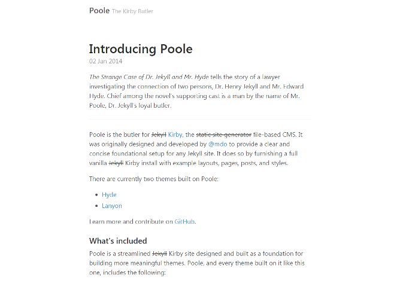

# Kirby Poole
  

A Kirby port of the [Jekyll](https://jekyllrb.com) theme '[Poole](https://github.com/poole/poole)'.

**Table of contents**
- [1. Getting started](#getting-started)
- [2. Credits / License](#credits--license)

## Getting started
Use one of the following methods to start blogging with `kirby-poole`:

1. [Clone](https://github.com/S1SYPHOS/kirby-poole.git) or [download](https://github.com/S1SYPHOS/kirby-poole/archive/master.zip) this repository.
2. Unzip / Upload the folder to your site's `root`.

For more information, check out the [original project](https://github.com/poole/poole) or view [its demo](http://poole.getpoole.com/) - `kirby-poole` basically looks the same.

## Credits / License
This is a [port](https://en.wikipedia.org/wiki/Porting) of the Jekyll theme 'Poole', which was originally developed by [@mdo](https://github.com/mdo). `kirby-poole` is licensed under the [MIT License](LICENSE), but **using Kirby in production** requires you to [buy a license](https://getkirby.com/buy). Are you ready for the [next step](https://getkirby.com/next)?

## Special Thanks
I'd like to thank everybody that's making great software - you people are awesome. Also I'm always thankful for feedback and bug reports :)
